# 漫画多语言智能翻译与图像合成系统 - 系统架构设计说明书

---

**文档版本**：2.0  
**创建时间**：2025-07-11  
**更新时间**：2026-06-30  
**对应PRD版本**：v3.0  
**文档状态**：已更新 ✅  
**变更说明**：基于v3.0 PRD全面升级，新增28大模块架构支撑、v2.0/v3.0新增服务、端云协同架构、有声剧场与动态漫画服务

---

## 目录

1. [技术选型总览](#一技术选型总览)
2. [系统框架设计](#二系统框架设计)
3. [数据库表设计](#三数据库表设计)
4. [接口规范设计](#四接口规范设计)
5. [技术风险评估](#五技术风险评估)
6. [架构评审与打分](#六架构评审与打分)

---

## 一、技术选型总览

### 1.1 技术栈总表

| 层级 | 技术选型 | 版本 | 选型理由 |
|------|----------|------|----------|
| **前端框架** | React + Next.js (App Router) | 18 + 14 | Canvas/图像编辑生态成熟；SSR优化首屏；PC端+移动端双端响应式复用 |
| **UI组件库(PC)** | Ant Design | 5.x | 企业级中后台最佳实践，三栏布局天然支持 |
| **UI组件库(Mobile)** | Ant Design Mobile | 5.x | 与PC端设计语言统一，触控组件完善 |
| **图像编辑引擎** | react-konva + fabric.js | - | Canvas矢量选区编辑、多边形节点操作 |
| **状态管理** | Zustand | 4.x | 轻量级，比Redux更适合图像编辑场景的频繁局部更新 |
| **API网关** | Go (Gin) | 1.9+ | 高并发文件上传下载、JWT鉴权、限流熔断、请求路由分发 |
| **核心业务服务** | Python FastAPI | 0.110+ | AI/ML生态原生支持，异步高性能，微服务独立部署 |
| **异步任务队列** | Celery + Redis (MVP) → RabbitMQ (生产) | 5.x + 7.x → 3.12 | 批量处理、导出队列、翻译管线编排；MVP阶段Redis作Broker，生产升级RabbitMQ |
| **主数据库** | PostgreSQL | 16 | JSONB支持半结构化数据，ACID事务保证数据一致性 |
| **缓存数据库** | Redis | 7.x | 翻译记忆缓存、会话管理、分布式锁、任务状态、Celery Broker |
| **对象存储** | MinIO | latest | S3兼容，私有化部署，可平滑迁移云OSS |
| **容器化** | Docker + Docker Compose | - | MVP阶段快速部署，后续可迁移K8s |
| **CI/CD** | GitHub Actions | - | 与代码仓库集成，自动构建部署 |
| **监控告警** | Prometheus + Grafana | - | 开源标准方案，GPU节点监控，仪表盘可视化 |
| **日志采集** | Loki + Promtail | - | 轻量级日志聚合，与Grafana统一面板 |
| **字体渲染** | Pillow + 自研排版引擎 | - | 漫画字体样式渲染、气泡自适应排版 |

### 1.2 AI模型服务矩阵

| 能力 | 推荐模型 | 部署方式 | GPU需求 | 优先级 |
|------|----------|----------|---------|--------|
| 文字区域检测 | 漫画专用检测模型（CRAFT/DBnet微调） | AI Gateway微服务 | T4 16GB | P0 |
| OCR识别 | MangaOCR / PaddleOCR | AI Gateway微服务 | T4 16GB | P0 |
| 基础翻译引擎 | Qwen2.5-7B-Instruct (翻译微调) | AI Gateway微服务 | A10 24GB | P0 |
| 多模态翻译引擎 | Qwen2-VL-7B / GPT-4V API | 自部署+云端API混合 | A10 24GB | P1 |
| 背景修复(文字擦除) | LaMa Inpainting | AI Gateway微服务 | T4 16GB | P0 |
| 背景修复(全气泡) | Stable Diffusion Inpainting | AI Gateway微服务 | A10 24GB | P0 |
| 超分辨率 | Real-ESRGAN (漫画模型) | AI Gateway微服务 | T4 16GB | P1 |
| 内容安全 | 腾讯云/阿里云API | 云端API | 无需 | P0 |
| TTS语音合成 | Edge-TTS / 微软Azure TTS | 云端API | 无需 | P2 |
| 擦除质量评估 | SSIM + LPIPS感知模型 | AI Gateway微服务 | T4 16GB | P0 |
| 角色语气识别 | 基于视觉特征的多模态模型 | AI Gateway微服务 | A10 24GB | P1 |

---

## 二、系统框架设计

### 2.1 整体架构拓扑（v3.0 完整版）

```
                                 ┌──────────────────────────────────────┐
                                 │              CDN + WAF               │
                                 │    (静态资源加速 + DDoS防护)          │
                                 └──────────────┬───────────────────────┘
                                                │
                                 ┌──────────────┴───────────────────────┐
                                 │          Nginx 反向代理               │
                                 │   (SSL终止 + 路由分发 + 限流)         │
                                 └──────┬──────────────┬────────────────┘
                                        │              │
                     ┌──────────────────┘              └──────────────────┐
                     │                                                    │
         ┌───────────┴───────────┐                        ┌───────────────┴───────────┐
         │    Go API Gateway     │                        │    Next.js Frontend        │
         │   (Gin Framework)     │                        │   (SSR + BFF层)            │
         │   端口: 8080           │                        │                            │
         │                       │                        │  • PC端三栏编辑工作台       │
         │  • JWT鉴权            │                        │  • 移动端底部Tab导航       │
         │  • 限流熔断            │                        │  • PWA Service Worker      │
         │  • 文件上传代理        │                        │  • Canvas图像编辑          │
         │  • 请求路由分发        │                        │  • 校对工作台               │
         └───────────┬───────────┘                        │  • 有声剧场播放器          │
                     │                                   │  • 动态漫画预览器          │
                     │  REST                              └──────────────────────────────┘
                     │
    ┌────────────────┼───────────────────────────────────────────────────────────────┐
    │                │            核心微服务集群 (8个业务服务)                          │
    │                │                                                               │
    │   ┌────────────┴────────────┐   ┌────────────────────────────────┐             │
    │   │   User Service          │   │   Project Service              │             │
    │   │   (FastAPI) 端口:8001   │   │   (FastAPI) 端口:8002          │             │
    │   │                         │   │                                │             │
    │   │   • 注册/登录/Token管理  │   │   • 作品-章节-页面三级CRUD      │             │
    │   │   • 偏好设置同步         │   │   • 文件上传/解析(CBZ/ZIP/PDF) │             │
    │   │   • 付费权益管理         │   │   • 缩略图生成                 │             │
    │   │   • 账号信息管理         │   │   • 回收站管理(30天)           │             │
    │   └─────────────────────────┘   │   • 页面状态管理               │             │
    │                                 └────────────────────────────────┘             │
    │   ┌─────────────────────────┐   ┌────────────────────────────────┐             │
    │   │   Translation Service   │   │   Image Process Service        │             │
    │   │   (FastAPI) 端口:8003   │   │   (FastAPI) 端口:8004          │             │
    │   │                         │   │                                │             │
    │   │   • 双引擎翻译调度       │   │   • 文字区域检测               │             │
    │   │   • 翻译记忆管理         │   │   • OCR识别(多语言)            │             │
    │   │   • 术语库管理           │   │   • 背景修复/擦除(分级)        │             │
    │   │   • 角色化翻译(v2.0)    │   │   • 文字回填渲染               │             │
    │   │   • 多模态翻译           │   │   • 超分辨率/画质增强          │             │
    │   │   • 腾讯TMT集成         │   │   • 擦除质量评估(SSIM)        │             │
    │   └─────────────────────────┘   │   • 字体渲染与管理             │             │
    │                                 └────────────────────────────────┘             │
    │   ┌─────────────────────────┐   ┌────────────────────────────────┐             │
    │   │   Export Service        │   │   Reader Service               │             │
    │   │   (FastAPI) 端口:8005   │   │   (FastAPI) 端口:8006          │             │
    │   │                         │   │                                │             │
    │   │   • 单页/批量导出        │   │   • 阅读器数据接口             │             │
    │   │   • 格式转换(CBZ/PDF)    │   │   • 生词本管理                 │             │
    │   │   • 双语对照合成         │   │   • 单词查询/加入生词本        │             │
    │   │   • 动态漫画视频导出     │   │   • 阅读进度同步               │             │
    │   │   • 异步队列管理         │   │   • 跨作品搜索(v3.0)          │             │
    │   └─────────────────────────┘   └────────────────────────────────┘             │
    │                                                                                │
    │   ┌─────────────────────────┐   ┌────────────────────────────────┐             │
    │   │   AI Gateway            │   │   Notification Service         │             │
    │   │   (FastAPI) 端口:8100   │   │   (FastAPI) 端口:8007          │             │
    │   │                         │   │                                │             │
    │   │   • AI模型统一调度       │   │   • 站内通知                   │             │
    │   │   • GPU资源管理          │   │   • 邮件通知                   │             │
    │   │   • 模型推理路由         │   │   • 推送通知(PWA)              │             │
    │   │   • 内容安全检测         │   │   • 通知类型配置               │             │
    │   │   • TTS语音合成          │   └────────────────────────────────┘             │
    │   │   • GPU调度器(gpu_       │                                                  │
    │   │     scheduler.py)        │                                                  │
    │   └─────────────────────────┘                                                  │
    │                                                                                │
    └────────────────────────────────────────────────────────────────────────────────┘
                     │                           │
    ┌────────────────┼───────────────┐   ┌───────┴───────────┐
    │   消息队列 & 异步任务层        │   │   数据存储层       │
    │                                │   │                   │
    │   ┌───────────────────────┐   │   │   ┌───────────┐   │
    │   │   Redis 7              │   │   │   │PostgreSQL │   │
    │   │   (任务队列+Celery     │   │   │   │  16主数据库│   │
    │   │    Broker+缓存)        │   │   │   └───────────┘   │
    │   │   ↓ 生产环境升级为     │   │   │                   │
    │   │   RabbitMQ             │   │   │   ┌───────────┐   │
    │   └───────────┬───────────┘   │   │   │  Redis 7  │   │
    │               │               │   │   │  缓存/会话 │   │
    │   ┌───────────┴───────────┐   │   │   └───────────┘   │
    │   │   Celery Workers      │   │   │                   │
    │   │   (2并发)              │   │   │   ┌───────────┐   │
    │   │                       │   │   │   │  MinIO    │   │
    │   │   • 批量翻译任务       │   │   │   │  对象存储  │   │
    │   │   • 批量导出任务       │   │   │   └───────────┘   │
    │   │   • 图像处理流水线     │   │   │                   │
    │   │   • 通知推送           │   │   └───────────────────┘
    │   │   • 翻译管线编排       │   │
    │   └───────────────────────┘   │
    │                                │
    └────────────────────────────────┘
```

### 2.2 分层架构设计（v3.0 六层架构）

```
┌─────────────────────────────────────────────────────────────────────┐
│                    表现层 (Presentation Layer)                       │
│  ┌──────────────────────┐  ┌────────────────────────────────────┐   │
│  │  PC端 (Next.js SSR)  │  │  移动端 (Next.js Responsive)       │   │
│  │  • 三栏编辑工作台     │  │  • 底部Tab导航(首页/作品/阅读/我的)│   │
│  │  • Canvas图像编辑     │  │  • 触控手势适配                   │   │
│  │  • 快捷键操作         │  │  • PWA离线缓存+后台同步           │   │
│  │  • 校对工作台(双栏)   │  │  • 快速翻译入口                   │   │
│  │  • 有声剧场播放器     │  │  • 有声剧场朗读                   │   │
│  │  • 动态漫画预览器     │  │  • 动态漫画短视频分享             │   │
│  └──────────────────────┘  └────────────────────────────────────┘   │
├─────────────────────────────────────────────────────────────────────┤
│                    接入层 (Gateway Layer)                            │
│  • Nginx反向代理 (SSL终止、静态资源、限流)                           │
│  • Go API Gateway (鉴权、路由、熔断、文件上传代理)                   │
├─────────────────────────────────────────────────────────────────────┤
│                    业务服务层 (Service Layer) - 8个微服务             │
│  ┌──────────┐ ┌──────────┐ ┌──────────┐ ┌──────────┐               │
│  │User Svc  │ │Project   │ │Translat  │ │Image     │               │
│  │(8001)    │ │Svc(8002) │ │Svc(8003) │ │Proc(8004)│               │
│  └──────────┘ └──────────┘ └──────────┘ └──────────┘               │
│  ┌──────────┐ ┌──────────┐ ┌──────────┐ ┌──────────┐               │
│  │Export    │ │Reader    │ │AI        │ │Notif     │               │
│  │Svc(8005) │ │Svc(8006) │ │Gateway   │ │Svc(8007) │               │
│  └──────────┘ └──────────┘ │(8100)    │ └──────────┘               │
│                             └──────────┘                            │
├─────────────────────────────────────────────────────────────────────┤
│                    AI模型服务层 (Model Inference Layer)               │
│  ┌──────────┐ ┌──────────┐ ┌──────────┐ ┌──────────┐               │
│  │Detector  │ │OCR       │ │LLM       │ │Inpaint   │               │
│  │Service   │ │Service   │ │Service   │ │Service   │               │
│  │(CRAFT)   │ │(MangaOCR)│ │(Qwen)    │ │(LaMa)    │               │
│  └──────────┘ └──────────┘ └──────────┘ └──────────┘               │
│  ┌──────────┐ ┌──────────┐ ┌──────────┐                            │
│  │SR        │ │Content   │ │TTS       │                            │
│  │Service   │ │Safety    │ │Service   │                            │
│  │(Real-    │ │(腾讯云)  │ │(Edge-TTS)│                            │
│  │ ESRGAN)  │ │          │ │          │                            │
│  └──────────┘ └──────────┘ └──────────┘                            │
├─────────────────────────────────────────────────────────────────────┤
│                    异步任务层 (Async Task Layer)                     │
│  • Redis 消息队列 (MVP: Celery Broker + 任务分发)                   │
│  • Celery Workers (批量处理、导出、通知、翻译管线)                   │
│  • [生产升级] RabbitMQ 消息队列 (事件驱动架构)                       │
├─────────────────────────────────────────────────────────────────────┤
│                    数据存储层 (Data Layer)                           │
│  ┌──────────┐ ┌──────────┐ ┌──────────┐                            │
│  │PostgreSQL│ │  Redis 7 │ │  MinIO   │                            │
│  │ 16(主数据)│ │(缓存/会话│ │(对象存储) │                            │
│  └──────────┘ └──────────┘ └──────────┘                            │
│  + Prometheus + Grafana + Loki (可观测性)                           │
└─────────────────────────────────────────────────────────────────────┘
```

### 2.3 核心模块划分与职责（v3.0 完整28模块）

| 模块 | 归属服务 | 核心职责 | 优先级 |
|------|----------|----------|--------|
| **1.图像导入与项目管理** | Project Service | 多格式批量导入、作品-章节-页面三级管理 | P0 |
| **2.文字区域检测** | Image Process Service + AI Gateway | 调用检测模型、选区管理、低置信度标记 | P0 |
| **3.多模态智能翻译** | Translation Service + AI Gateway | 双引擎调度、翻译记忆、角色化翻译 | P0 |
| **4.背景修复与文字回填** | Image Process Service | 分级擦除、AI排版引擎2.0、字体渲染 | P0 |
| **5.图像合成与导出** | Export Service | 单页/批量导出、CBZ/PDF打包、双语合成 | P0 |
| **6.画质增强** | Image Process Service | 超分辨率、扫描件修复、色彩增强 | P1 |
| **7.双语阅读器** | Reader Service | 沉浸式在线阅读、学习辅助 | P0 |
| **8.特殊格式适配** | Image Process Service | 条漫全流程支持 | P1 |
| **9.个人中心** | User Service | 账号同步、偏好管理、付费权益 | P0 |
| **10.多端适配** | Frontend | 电脑端+移动端全覆盖 | P0 |
| **11.智能批量校对工作台** | Frontend + Project Service | 双栏对照、批量替换、智能高亮、键盘导航 | P0 |
| **12.翻译质量评估** | Translation Service | BLEU/METEOR自动打分、人工反馈闭环 | P1 |
| **13.角色语气一致性** | Translation Service + AI Gateway | 角色库管理、跨页风格一致性 | P1 |
| **14.AI排版引擎2.0** | Image Process Service | 气泡轮廓精确提取、多目标优化排版 | P1 |
| **15.端云协同推理** | AI Gateway + Frontend | ONNX.js端侧检测、WebGPU加速 | P2 |
| **16.主动学习闭环** | AI Gateway + Translation Service | 不确定样本识别、模型热更新 | P2 |
| **17.社交化学习社区** | Reader Service | 漫画日语课程、生词本复习、成就系统 | P2 |
| **18.PWA 2.0离线模式** | Frontend | 离线阅读、后台同步、推送通知 | P1 |
| **19.无障碍设计(A11y)** | Frontend | 屏幕阅读器、高对比度、键盘可控 | P2 |
| **20.API开放平台** | Gateway + 各Service | 翻译API、OCR API、SDK/插件生态 | P1 |
| **21.GPU算力调度** | AI Gateway | 优先级队列、模型路由、弹性伸缩 | P1 |
| **22.智能擦除引擎增强** | Image Process Service | 分背景类型质量标准、擦除失败降级策略 | P0 |
| **23.字体管理与智能匹配** | Image Process Service + Frontend | 字体库管理、字体-角色绑定、缺字回退 | P1 |
| **24.新手引导与帮助体系** | Frontend | 首次引导流程、示例项目、空状态引导 | P1 |
| **25.内容安全与合规** | AI Gateway + Project Service | 违规内容检测、UGC审核、隐私合规 | P1 |
| **26.漫画有声剧场模式** | AI Gateway + Reader Service | 角色分声TTS、场景音效、双语朗读 | P2 |
| **27.动态漫画模式** | Export Service + AI Gateway | 智能运镜、气泡动画、微动特效、短视频导出 | P2 |
| **28.对话跨作品搜索** | Reader Service | 跨漫画全文搜索名场面/经典对话 | P2 |

### 2.4 模块间依赖关系

```
                         ┌──────────────┐
                         │  User Svc    │
                         │   (8001)     │
                         └──────┬───────┘
                                │ (认证依赖 - 所有服务)
         ┌──────────────────────┼──────────────────────┐
         │                      │                      │
         ▼                      ▼                      ▼
  ┌──────────────┐    ┌──────────────┐    ┌──────────────┐
  │ Project Svc  │◄───│ Translation  │    │ Reader Svc   │
  │   (8002)     │    │    Svc       │    │   (8006)     │
  │              │    │   (8003)     │    │              │
  └──────┬───────┘    └──────┬───────┘    └──────┬───────┘
         │                   │                   │
         │ (图像处理依赖)     │ (AI翻译依赖)      │ (搜索依赖)
         │                   │                   │
         ▼                   ▼                   ▼
  ┌──────────────┐    ┌──────────────┐    ┌──────────────┐
  │ Image Proc   │    │  AI Gateway  │    │  Export Svc  │
  │    Svc       │◄───│   (8100)     │    │   (8005)     │
  │   (8004)     │    │              │    │              │
  └──────┬───────┘    └──────────────┘    └──────────────┘
         │                                     ▲
         │ (导出依赖)                           │
         └─────────────────────────────────────┘

  ┌──────────────┐
  │Notification  │  (被所有服务调用发送通知)
  │   Svc(8007)  │
  └──────────────┘

依赖说明：
• 所有业务服务依赖 User Svc 进行JWT Token验证
• Translation Svc 依赖 Project Svc 获取页面/区域数据
• Image Process Svc 依赖 AI Gateway 进行AI推理
• AI Gateway 统一调度所有AI模型服务(检测/OCR/翻译/修复/超分/TTS)
• Export Svc 依赖 Project Svc + Image Process Svc 获取处理后数据
• Reader Svc 依赖 Project Svc 获取阅读数据，依赖 Translation Svc 获取翻译
• Notification Svc 被所有服务调用发送任务完成/系统通知
• 服务间通过 REST API（同步调用）+ Celery/Redis（异步任务）通信
```

### 2.5 核心处理管线流程（v3.0 增强版）

```
                     漫画翻译处理管线 (Pipeline)
                     ═══════════════════════════

  [上传图片] → [预处理] → [文字区域检测] → [OCR识别] → [翻译]
       │         │              │              │           │
       │         │              │              │           │
       │         │              │              │           ▼
       │         │              │              │    ┌──────────────┐
       │         │              │              │    │ 术语匹配     │
       │         │              │              │    │ 翻译记忆复用 │
       │         │              │              │    │ 角色化翻译   │
       │         │              │              │    └──────┬───────┘
       │         │              │              │           │
       │         │              │              │           ▼
       │         │              │              │    [背景修复/擦除] → [质量评估]
       │         │              │              │           │              │
       │         │              │              │           │    SSIM<0.85? │
       │         │              │              │           │    ┌───┴───┐  │
       │         │              │              │           │    │是    │否 │
       │         │              │              │           │    ▼      ▼  │
       │         │              │              │    [文字回填渲染]  [标记需修复]
       │         │              │              │           │
       │         │              │              │           ▼
       │         │              │              │    [成品输出] → [导出]
       │         │              │              │           │
       │         │              │              │           └── [画质增强(可选)]

  管线编排方式：
  • 简易模式：全流程自动串联，Celery Pipeline 一键触发
  • 专业模式：每步独立触发，用户可在步骤间手动调整
  • 批量模式：Celery Chords 并行处理多页，汇总后回调通知
  • v3.0新增：擦除质量评估闭环，低质量自动标记并引导人工修复
```

### 2.6 部署架构图（v3.0 完整版）

```
                          Internet
                             │
                    ┌────────┴────────┐
                    │   CloudFlare    │  (CDN + DNS + DDoS防护)
                    └────────┬────────┘
                             │
              ┌──────────────┴──────────────┐
              │      负载均衡 (Nginx)        │
              │   (SSL终止 + 路由分发)       │
              └──────┬──────────┬───────────┘
                     │          │
         ┌───────────┘          └───────────┐
         │                                  │
  ┌──────┴──────┐                   ┌──────┴──────┐
  │  Web Node   │                   │  Web Node   │
  │  (Next.js)  │                   │  (Next.js)  │
  │  PC+Mobile  │                   │  PC+Mobile  │
  └──────┬──────┘                   └──────┬──────┘
         │                                  │
         └──────────────┬───────────────────┘
                        │
              ┌─────────┴─────────┐
              │  API Gateway      │
              │  (Go/Gin) x2      │  (主备)
              └─────────┬─────────┘
                        │
        ┌───────────────┼───────────────────────┐
        │               │                       │
  ┌─────┴─────┐  ┌──────┴──────┐   ┌───────────┴───────────┐
  │ Service   │  │  Service    │   │   Service              │
  │ Nodes     │  │  Nodes      │   │   Nodes                │
  │ (FastAPI) │  │  (FastAPI)  │   │   (FastAPI)            │
  │ User/Proj │  │  Trans/Img  │   │  Export/Read/Notify    │
  └─────┬─────┘  └──────┬──────┘   └───────────┬───────────┘
        │               │                       │
        └───────────────┼───────────────────────┘
                        │
        ┌───────────────┼───────────────────────┐
        │               │                       │
  ┌─────┴─────┐  ┌──────┴──────┐   ┌───────────┴───────────┐
  │ GPU Node  │  │  GPU Node   │   │   GPU Node             │
  │ Detector  │  │  OCR/Inpaint│   │   LLM/SR/TTS          │
  │ (T4)      │  │  (T4)       │   │   (A10)                │
  └───────────┘  └─────────────┘   └───────────────────────┘
                        │
        ┌───────────────┼───────────────────────┐
        │               │                       │
  ┌─────┴─────┐  ┌──────┴──────┐   ┌───────────┴───────────┐
  │PostgreSQL │  │   Redis     │   │    MinIO               │
  │ 16(主+从)  │  │  7(Cluster) │   │  (对象存储)             │
  └───────────┘  └─────────────┘   └───────────────────────┘
        │               │                       │
  ┌─────┴─────┐  ┌──────┴──────┐   ┌───────────┴───────────┐
  │Prometheus │  │   Celery    │   │  Grafana + Loki       │
  │ + Grafana │  │  Workers    │   │  (日志+仪表盘)         │
  └───────────┘  └─────────────┘   └───────────────────────┘
```

### 2.7 Docker Compose 服务清单（实际部署）

| 服务名 | 容器名 | 端口 | 镜像/构建 | 功能 |
|--------|--------|------|-----------|------|
| postgres | manga-postgres | 5432 | postgres:16-alpine | 主数据库 |
| redis | manga-redis | 6379 | redis:7-alpine | 缓存+消息队列 |
| minio | manga-minio | 9000/9001 | minio/minio:latest | 对象存储 |
| gateway | manga-gateway | 8080 | Go/Gin自建 | API网关 |
| user-service | manga-user-service | 8001 | FastAPI自建 | 用户认证服务 |
| project-service | manga-project-service | 8002 | FastAPI自建 | 项目管理服务 |
| translation-service | manga-translation-service | 8003 | FastAPI自建 | 翻译服务 |
| image-service | manga-image-service | 8004 | FastAPI自建 | 图像处理服务 |
| export-service | manga-export-service | 8005 | FastAPI自建 | 导出服务 |
| reader-service | manga-reader-service | 8006 | FastAPI自建 | 阅读器服务 |
| ai-gateway | manga-ai-gateway | 8100 | FastAPI自建 | AI模型网关(GPU Ready) |
| notification-service | manga-notification-service | 8007 | FastAPI自建 | 通知服务 |
| celery-worker | manga-celery-worker | - | FastAPI自建 | 异步任务Worker(2并发) |
| prometheus | manga-prometheus | 9090 | prom/prometheus:latest | 指标监控 |
| loki | manga-loki | 3100 | grafana/loki:latest | 日志聚合 |
| promtail | manga-promtail | - | grafana/promtail:latest | 日志采集 |
| grafana | manga-grafana | 3001 | grafana/grafana:latest | 仪表盘 |

---

## 三、数据库表设计

### 3.1 ER图（v3.0 完整版）

```plantuml
@startuml 漫画翻译系统ER图 v3.0

!define table(x) class x << (T,#FFAAAA) >>
!define pk(x) <b><u>x</u></b>
!define fk(x) <i>x (FK)</i>

entity "users" as users {
  pk(user_id): UUID
  --
  email: VARCHAR(255)
  phone: VARCHAR(20)
  password_hash: VARCHAR(255)
  nickname: VARCHAR(100)
  avatar_url: VARCHAR(500)
  plan_type: VARCHAR(20)
  premium_expires: TIMESTAMPTZ
  settings: JSONB
  created_at: TIMESTAMPTZ
  updated_at: TIMESTAMPTZ
}

entity "projects" as projects {
  pk(project_id): UUID
  --
  fk(user_id): UUID
  name: VARCHAR(200)
  source_lang: VARCHAR(10)
  cover_url: VARCHAR(500)
  is_favorite: BOOLEAN
  status: VARCHAR(20)
  trashed_at: TIMESTAMPTZ
  created_at: TIMESTAMPTZ
  updated_at: TIMESTAMPTZ
}

entity "chapters" as chapters {
  pk(chapter_id): UUID
  --
  fk(project_id): UUID
  name: VARCHAR(200)
  sort_order: INTEGER
  created_at: TIMESTAMPTZ
  updated_at: TIMESTAMPTZ
}

entity "pages" as pages {
  pk(page_id): UUID
  --
  fk(chapter_id): UUID
  original_url: VARCHAR(500)
  processed_url: VARCHAR(500)
  thumbnail_url: VARCHAR(500)
  sort_order: INTEGER
  status: VARCHAR(20)
  width: INTEGER
  height: INTEGER
  file_size: INTEGER
  ocr_result: JSONB
  translation_result: JSONB
  preprocessing_result: JSONB
  erase_quality_score: FLOAT
  created_at: TIMESTAMPTZ
  updated_at: TIMESTAMPTZ
}

entity "text_regions" as text_regions {
  pk(region_id): UUID
  --
  fk(page_id): UUID
  type: VARCHAR(20)
  boundary: JSONB
  boundary_mode: VARCHAR(20)
  original_text: TEXT
  translated_text: TEXT
  confidence: FLOAT
  is_locked: BOOLEAN
  character_id: UUID
  style_config: JSONB
  sort_order: INTEGER
  created_at: TIMESTAMPTZ
  updated_at: TIMESTAMPTZ
}

entity "term_entries" as term_entries {
  pk(term_id): UUID
  --
  fk(user_id): UUID
  fk(project_id): UUID
  source_text: VARCHAR(500)
  target_text: VARCHAR(500)
  note: TEXT
  category: VARCHAR(50)
  scope: VARCHAR(20)
  created_at: TIMESTAMPTZ
  updated_at: TIMESTAMPTZ
}

entity "style_presets" as style_presets {
  pk(preset_id): UUID
  --
  fk(user_id): UUID
  fk(project_id): UUID
  name: VARCHAR(100)
  category: VARCHAR(20)
  style_config: JSONB
  scope: VARCHAR(20)
  created_at: TIMESTAMPTZ
}

entity "operation_histories" as operation_histories {
  pk(history_id): UUID
  --
  fk(user_id): UUID
  fk(project_id): UUID
  fk(page_id): UUID
  operation_type: VARCHAR(50)
  before_state: JSONB
  after_state: JSONB
  created_at: TIMESTAMPTZ
}

entity "export_tasks" as export_tasks {
  pk(task_id): UUID
  --
  fk(user_id): UUID
  fk(project_id): UUID
  chapter_ids: JSONB
  format: VARCHAR(10)
  quality: INTEGER
  resolution: VARCHAR(10)
  bilingual_mode: VARCHAR(20)
  naming_rule: VARCHAR(200)
  status: VARCHAR(20)
  progress: FLOAT
  result_url: VARCHAR(500)
  error_msg: TEXT
  created_at: TIMESTAMPTZ
  completed_at: TIMESTAMPTZ
}

entity "vocabularies" as vocabularies {
  pk(vocab_id): UUID
  --
  fk(user_id): UUID
  word: VARCHAR(200)
  language: VARCHAR(10)
  definition: TEXT
  part_of_speech: VARCHAR(50)
  example_sentence: TEXT
  fk(source_project_id): UUID
  created_at: TIMESTAMPTZ
}

entity "notifications" as notifications {
  pk(notification_id): UUID
  --
  fk(user_id): UUID
  type: VARCHAR(30)
  title: VARCHAR(200)
  content: TEXT
  is_read: BOOLEAN
  ref_type: VARCHAR(20)
  ref_id: UUID
  created_at: TIMESTAMPTZ
}

entity "reading_progress" as reading_progress {
  pk(progress_id): UUID
  --
  fk(user_id): UUID
  fk(project_id): UUID
  fk(chapter_id): UUID
  fk(page_id): UUID
  scroll_position: FLOAT
  zoom_level: FLOAT
  read_duration: INTEGER
  is_completed: BOOLEAN
  last_read_at: TIMESTAMPTZ
  created_at: TIMESTAMPTZ
  updated_at: TIMESTAMPTZ
}

entity "translation_cache" as translation_cache {
  pk(cache_id): UUID
  --
  fk(project_id): UUID
  source_text: TEXT
  translated_text: TEXT
  source_lang: VARCHAR(10)
  target_lang: VARCHAR(10)
  similarity_hash: VARCHAR(64)
  hit_count: INTEGER
  created_at: TIMESTAMPTZ
  updated_at: TIMESTAMPTZ
}

entity "user_sessions" as user_sessions {
  pk(session_id): UUID
  --
  fk(user_id): UUID
  refresh_token_hash: VARCHAR(255)
  device_info: VARCHAR(500)
  ip_address: VARCHAR(45)
  expires_at: TIMESTAMPTZ
  created_at: TIMESTAMPTZ
}

entity "characters" as characters {
  pk(character_id): UUID
  --
  fk(project_id): UUID
  name: VARCHAR(200)
  tone_type: VARCHAR(30)
  custom_tone_params: JSONB
  catchphrase: TEXT
  honorific_level: VARCHAR(20)
  gender: VARCHAR(10)
  visual_features: JSONB
  voice_id: VARCHAR(100)
  font_id: UUID
  created_at: TIMESTAMPTZ
}

entity "fonts" as fonts {
  pk(font_id): UUID
  --
  fk(user_id): UUID
  name: VARCHAR(100)
  file_url: VARCHAR(500)
  category: VARCHAR(20)
  style_tags: JSONB
  license: VARCHAR(30)
  is_active: BOOLEAN
  created_at: TIMESTAMPTZ
}

entity "translation_quality" as translation_quality {
  pk(quality_id): UUID
  --
  fk(page_id): UUID
  bleu_score: FLOAT
  meteor_score: FLOAT
  tone_consistency: FLOAT
  term_consistency: FLOAT
  overall_score: FLOAT
  report_json: JSONB
  created_at: TIMESTAMPTZ
}

entity "feedback" as feedback {
  pk(feedback_id): UUID
  --
  fk(user_id): UUID
  fk(region_id): UUID
  original_translation: TEXT
  user_translation: TEXT
  rating: VARCHAR(10)
  used_for_training: BOOLEAN
  created_at: TIMESTAMPTZ
}

entity "collaboration_locks" as collaboration_locks {
  pk(lock_id): UUID
  --
  fk(page_id): UUID
  fk(user_id): UUID
  locked_at: TIMESTAMPTZ
  expires_at: TIMESTAMPTZ
  lock_type: VARCHAR(20)
}

entity "comments" as comments {
  pk(comment_id): UUID
  --
  fk(region_id): UUID
  fk(page_id): UUID
  fk(user_id): UUID
  content: TEXT
  mentioned_user_ids: JSONB
  status: VARCHAR(20)
  parent_comment_id: UUID
  created_at: TIMESTAMPTZ
}

entity "api_keys" as api_keys {
  pk(api_key_id): UUID
  --
  fk(user_id): UUID
  key_hash: VARCHAR(255)
  key_prefix: VARCHAR(8)
  name: VARCHAR(100)
  permissions: JSONB
  rate_limit: INTEGER
  total_calls: BIGINT
  is_active: BOOLEAN
  expires_at: TIMESTAMPTZ
  last_used_at: TIMESTAMPTZ
  created_at: TIMESTAMPTZ
}

entity "learning_progress" as learning_progress {
  pk(progress_id): UUID
  --
  fk(user_id): UUID
  fk(vocab_id): UUID
  review_count: INTEGER
  last_review_at: TIMESTAMPTZ
  next_review_at: TIMESTAMPTZ
  mastery_level: INTEGER
  streak_days: INTEGER
}

' ----- Relationships -----
users ||--o{ projects : "拥有"
users ||--o{ term_entries : "拥有"
users ||--o{ style_presets : "拥有(可选)"
users ||--o{ operation_histories : "操作"
users ||--o{ export_tasks : "发起"
users ||--o{ vocabularies : "收藏"
users ||--o{ notifications : "接收"
users ||--o{ user_sessions : "登录"

projects ||--o{ chapters : "包含"
projects ||--o{ term_entries : "关联(可选)"
projects ||--o{ style_presets : "关联(可选)"
projects ||--o{ translation_cache : "缓存"

chapters ||--o{ pages : "包含"

pages ||--o{ text_regions : "包含"
pages ||--o{ operation_histories : "记录(可选)"
pages ||--o{ reading_progress : "阅读进度"

projects ||--o{ reading_progress : "关联"
users ||--o{ reading_progress : "阅读"

' ----- v2.0/v3.0 Relationships -----
pages ||--o{ translation_quality : "质量评估"
pages ||--o{ comments : "评论"
text_regions ||--o{ feedback : "翻译反馈"
projects ||--o{ characters : "角色"
projects ||--o{ collaboration_locks : "协作锁"
pages ||--o{ collaboration_locks : "页面锁定"
users ||--o{ collaboration_locks : "锁定者"
users ||--o{ comments : "评论者"
users ||--o{ api_keys : "API密钥"
users ||--o{ learning_progress : "学习进度"
vocabularies ||--o{ learning_progress : "学习记录"
users ||--o{ fonts : "自定义字体"

@enduml
```



### 3.2 核心业务表结构设计（v3.0 完整版）

#### 3.2.1 users（用户表）

```sql
CREATE TABLE users (
    user_id         UUID PRIMARY KEY DEFAULT gen_random_uuid(),
    email           VARCHAR(255) UNIQUE,
    phone           VARCHAR(20) UNIQUE,
    password_hash   VARCHAR(255) NOT NULL,
    nickname        VARCHAR(100) NOT NULL,
    avatar_url      VARCHAR(500),
    plan_type       VARCHAR(20) NOT NULL DEFAULT 'free'
                    CHECK (plan_type IN ('free', 'premium')),
    premium_expires TIMESTAMPTZ,
    settings        JSONB DEFAULT '{}'::jsonb,
    created_at      TIMESTAMPTZ NOT NULL DEFAULT NOW(),
    updated_at      TIMESTAMPTZ NOT NULL DEFAULT NOW(),
    
    CONSTRAINT chk_email_phone CHECK (email IS NOT NULL OR phone IS NOT NULL)
);

CREATE INDEX idx_users_email ON users(email) WHERE email IS NOT NULL;
CREATE INDEX idx_users_phone ON users(phone) WHERE phone IS NOT NULL;
```

#### 3.2.2 projects（作品表）

```sql
CREATE TABLE projects (
    project_id      UUID PRIMARY KEY DEFAULT gen_random_uuid(),
    user_id         UUID NOT NULL REFERENCES users(user_id) ON DELETE CASCADE,
    name            VARCHAR(200) NOT NULL,
    source_lang     VARCHAR(10) NOT NULL CHECK (source_lang IN ('ja','zh','en','ko','fr','es')),
    cover_url       VARCHAR(500),
    is_favorite     BOOLEAN NOT NULL DEFAULT FALSE,
    status          VARCHAR(20) NOT NULL DEFAULT 'active'
                    CHECK (status IN ('active', 'trashed')),
    trashed_at      TIMESTAMPTZ,
    created_at      TIMESTAMPTZ NOT NULL DEFAULT NOW(),
    updated_at      TIMESTAMPTZ NOT NULL DEFAULT NOW()
);

CREATE INDEX idx_projects_user_id ON projects(user_id);
CREATE INDEX idx_projects_status ON projects(status);
CREATE INDEX idx_projects_user_status ON projects(user_id, status);
```

#### 3.2.3 chapters（章节表）

```sql
CREATE TABLE chapters (
    chapter_id      UUID PRIMARY KEY DEFAULT gen_random_uuid(),
    project_id      UUID NOT NULL REFERENCES projects(project_id) ON DELETE CASCADE,
    name            VARCHAR(200) NOT NULL,
    sort_order      INTEGER NOT NULL,
    created_at      TIMESTAMPTZ NOT NULL DEFAULT NOW(),
    updated_at      TIMESTAMPTZ NOT NULL DEFAULT NOW(),
    
    UNIQUE (project_id, sort_order)
);

CREATE INDEX idx_chapters_project_id ON chapters(project_id);
```

#### 3.2.4 pages（页面表 - v3.0 增强）

```sql
CREATE TABLE pages (
    page_id             UUID PRIMARY KEY DEFAULT gen_random_uuid(),
    chapter_id          UUID NOT NULL REFERENCES chapters(chapter_id) ON DELETE CASCADE,
    original_url        VARCHAR(500) NOT NULL,
    processed_url       VARCHAR(500),
    thumbnail_url       VARCHAR(500),
    sort_order          INTEGER NOT NULL,
    status              VARCHAR(20) NOT NULL DEFAULT 'pending'
                        CHECK (status IN ('pending','translating','reviewing','reviewed','needs_repair','completed')),
    width               INTEGER NOT NULL,
    height              INTEGER NOT NULL,
    file_size           INTEGER NOT NULL,
    ocr_result          JSONB,
    translation_result  JSONB,
    preprocessing_result JSONB,
    erase_quality_score FLOAT,
    created_at          TIMESTAMPTZ NOT NULL DEFAULT NOW(),
    updated_at          TIMESTAMPTZ NOT NULL DEFAULT NOW(),
    
    UNIQUE (chapter_id, sort_order)
);

CREATE INDEX idx_pages_chapter_id ON pages(chapter_id);
CREATE INDEX idx_pages_status ON pages(status);
```

#### 3.2.5 text_regions（文字区域表 - v3.0 增强）

```sql
CREATE TABLE text_regions (
    region_id       UUID PRIMARY KEY DEFAULT gen_random_uuid(),
    page_id         UUID NOT NULL REFERENCES pages(page_id) ON DELETE CASCADE,
    type            VARCHAR(20) NOT NULL
                    CHECK (type IN ('speech','thought','narration','onomatopoeia','effect')),
    boundary        JSONB NOT NULL,
    boundary_mode   VARCHAR(20) NOT NULL DEFAULT 'rect'
                    CHECK (boundary_mode IN ('rect','polygon','bezier')),
    original_text   TEXT,
    translated_text TEXT,
    confidence      FLOAT CHECK (confidence >= 0 AND confidence <= 1),
    is_locked       BOOLEAN NOT NULL DEFAULT FALSE,
    character_id    UUID REFERENCES characters(character_id) ON DELETE SET NULL,
    style_config    JSONB,
    sort_order      INTEGER NOT NULL,
    created_at      TIMESTAMPTZ NOT NULL DEFAULT NOW(),
    updated_at      TIMESTAMPTZ NOT NULL DEFAULT NOW()
);

CREATE INDEX idx_text_regions_page_id ON text_regions(page_id);
CREATE INDEX idx_text_regions_type ON text_regions(type);
CREATE INDEX idx_text_regions_confidence ON text_regions(confidence) WHERE confidence < 0.6;
```

#### 3.2.6 characters（角色表 - v2.0 新增）

```sql
CREATE TABLE characters (
    character_id        UUID PRIMARY KEY DEFAULT gen_random_uuid(),
    project_id          UUID NOT NULL REFERENCES projects(project_id) ON DELETE CASCADE,
    name                VARCHAR(200) NOT NULL,
    tone_type           VARCHAR(30) NOT NULL
                        CHECK (tone_type IN ('tsundere','hotblooded','calm','cold','loli','genki','lazy','chuunibyou','natural','bellyblack','custom')),
    custom_tone_params  JSONB,
    catchphrase         TEXT,
    honorific_level     VARCHAR(20) CHECK (honorific_level IN ('casual','polite','formal')),
    gender              VARCHAR(10) CHECK (gender IN ('male','female','neutral')),
    visual_features     JSONB,
    voice_id            VARCHAR(100),
    font_id             UUID REFERENCES fonts(font_id) ON DELETE SET NULL,
    created_at          TIMESTAMPTZ NOT NULL DEFAULT NOW(),
    updated_at          TIMESTAMPTZ NOT NULL DEFAULT NOW()
);

CREATE INDEX idx_characters_project ON characters(project_id);
CREATE INDEX idx_characters_tone ON characters(tone_type);
```

#### 3.2.7 fonts（字体表 - v3.0 新增）

```sql
CREATE TABLE fonts (
    font_id     UUID PRIMARY KEY DEFAULT gen_random_uuid(),
    user_id     UUID REFERENCES users(user_id) ON DELETE CASCADE,
    name        VARCHAR(100) NOT NULL,
    file_url    VARCHAR(500) NOT NULL,
    category    VARCHAR(20) NOT NULL
                CHECK (category IN ('dialogue','narration','onomatopoeia','title')),
    style_tags  JSONB,
    license     VARCHAR(30) NOT NULL
                CHECK (license IN ('free_commercial','attribution','personal_only')),
    is_active   BOOLEAN NOT NULL DEFAULT true,
    created_at  TIMESTAMPTZ NOT NULL DEFAULT NOW()
);

CREATE INDEX idx_fonts_user ON fonts(user_id);
CREATE INDEX idx_fonts_category ON fonts(category);
```

#### 3.2.8 translation_quality（翻译质量评估表 - v2.0 新增）

```sql
CREATE TABLE translation_quality (
    quality_id      UUID PRIMARY KEY DEFAULT gen_random_uuid(),
    page_id         UUID NOT NULL REFERENCES pages(page_id) ON DELETE CASCADE,
    bleu_score      FLOAT,
    meteor_score    FLOAT,
    tone_consistency FLOAT,
    term_consistency FLOAT,
    overall_score   FLOAT,
    report_json     JSONB,
    created_at      TIMESTAMPTZ NOT NULL DEFAULT NOW()
);

CREATE INDEX idx_tq_page ON translation_quality(page_id);
```

#### 3.2.9 feedback（用户反馈表 - v2.0 新增）

```sql
CREATE TABLE feedback (
    feedback_id         UUID PRIMARY KEY DEFAULT gen_random_uuid(),
    user_id             UUID NOT NULL REFERENCES users(user_id) ON DELETE CASCADE,
    region_id           UUID NOT NULL REFERENCES text_regions(region_id) ON DELETE CASCADE,
    original_translation TEXT NOT NULL,
    user_translation    TEXT,
    rating              VARCHAR(10) CHECK (rating IN ('good','bad','neutral')),
    used_for_training   BOOLEAN NOT NULL DEFAULT FALSE,
    created_at          TIMESTAMPTZ NOT NULL DEFAULT NOW()
);

CREATE INDEX idx_feedback_user ON feedback(user_id);
CREATE INDEX idx_feedback_region ON feedback(region_id);
CREATE INDEX idx_feedback_training ON feedback(used_for_training) WHERE used_for_training = FALSE;
```

#### 3.2.10 collaboration_locks（协作锁表 - v2.0 新增）

```sql
CREATE TABLE collaboration_locks (
    lock_id     UUID PRIMARY KEY DEFAULT gen_random_uuid(),
    page_id     UUID NOT NULL REFERENCES pages(page_id) ON DELETE CASCADE,
    user_id     UUID NOT NULL REFERENCES users(user_id) ON DELETE CASCADE,
    locked_at   TIMESTAMPTZ NOT NULL DEFAULT NOW(),
    expires_at  TIMESTAMPTZ NOT NULL,
    lock_type   VARCHAR(20) NOT NULL CHECK (lock_type IN ('edit','review'))
);

CREATE INDEX idx_locks_page ON collaboration_locks(page_id);
CREATE INDEX idx_locks_expires ON collaboration_locks(expires_at);
```

#### 3.2.11 comments（评论标注表 - v2.0 新增）

```sql
CREATE TABLE comments (
    comment_id          UUID PRIMARY KEY DEFAULT gen_random_uuid(),
    region_id           UUID REFERENCES text_regions(region_id) ON DELETE CASCADE,
    page_id             UUID NOT NULL REFERENCES pages(page_id) ON DELETE CASCADE,
    user_id             UUID NOT NULL REFERENCES users(user_id) ON DELETE CASCADE,
    content             TEXT NOT NULL,
    mentioned_user_ids  JSONB,
    status              VARCHAR(20) NOT NULL DEFAULT 'open'
                        CHECK (status IN ('open','resolved')),
    parent_comment_id   UUID,
    created_at          TIMESTAMPTZ NOT NULL DEFAULT NOW()
);

CREATE INDEX idx_comments_page ON comments(page_id);
CREATE INDEX idx_comments_user ON comments(user_id);
CREATE INDEX idx_comments_status ON comments(status);
```

#### 3.2.12 api_keys（API密钥表 - v2.0 新增）

```sql
CREATE TABLE api_keys (
    api_key_id      UUID PRIMARY KEY DEFAULT gen_random_uuid(),
    user_id         UUID NOT NULL REFERENCES users(user_id) ON DELETE CASCADE,
    key_hash        VARCHAR(255) NOT NULL,
    key_prefix      VARCHAR(8) NOT NULL,
    name            VARCHAR(100) NOT NULL,
    permissions     JSONB NOT NULL,
    rate_limit      INTEGER NOT NULL DEFAULT 60,
    total_calls     BIGINT NOT NULL DEFAULT 0,
    is_active       BOOLEAN NOT NULL DEFAULT true,
    expires_at      TIMESTAMPTZ,
    last_used_at    TIMESTAMPTZ,
    created_at      TIMESTAMPTZ NOT NULL DEFAULT NOW()
);

CREATE INDEX idx_api_keys_user ON api_keys(user_id);
CREATE INDEX idx_api_keys_hash ON api_keys(key_hash);
```

#### 3.2.13 learning_progress（学习进度表 - v2.0 新增）

```sql
CREATE TABLE learning_progress (
    progress_id     UUID PRIMARY KEY DEFAULT gen_random_uuid(),
    user_id         UUID NOT NULL REFERENCES users(user_id) ON DELETE CASCADE,
    vocab_id        UUID REFERENCES vocabularies(vocab_id) ON DELETE CASCADE,
    review_count    INTEGER NOT NULL DEFAULT 0,
    last_review_at  TIMESTAMPTZ,
    next_review_at  TIMESTAMPTZ,
    mastery_level   INTEGER NOT NULL DEFAULT 1 CHECK (mastery_level BETWEEN 1 AND 5),
    streak_days     INTEGER NOT NULL DEFAULT 0
);

CREATE INDEX idx_lp_user ON learning_progress(user_id);
CREATE INDEX idx_lp_next_review ON learning_progress(next_review_at);
```

#### 3.2.14 其他核心表（同v1.0设计）

- **term_entries**：术语条目表（同v1.0，新增project_id关联支持项目级术语）
- **style_presets**：样式预设表（同v1.0）
- **operation_histories**：操作历史表（同v1.0，支持20步撤销/重做）
- **export_tasks**：导出任务表（同v1.0，新增动态漫画mp4格式支持）
- **vocabularies**：生词本表（同v1.0）
- **notifications**：通知表（同v1.0）
- **reading_progress**：阅读进度表（同v1.0）
- **translation_cache**：翻译记忆缓存表（同v1.0）
- **user_sessions**：用户会话表（同v1.0）

### 3.3 数据库初始化DDL（完整版）

请参见上方各表的 CREATE TABLE 语句，以下为补充的数据库初始化配置：

```sql
-- 启用UUID扩展
CREATE EXTENSION IF NOT EXISTS "pgcrypto";

-- 启用模糊匹配扩展（翻译记忆相似度搜索）
CREATE EXTENSION IF NOT EXISTS "pg_trgm";

-- 创建自动更新 updated_at 的函数
CREATE OR REPLACE FUNCTION update_updated_at_column()
RETURNS TRIGGER AS $$
BEGIN
    NEW.updated_at = NOW();
    RETURN NEW;
END;
$$ language 'plpgsql';

-- 为需要自动更新 updated_at 的表创建触发器
CREATE TRIGGER update_users_updated_at BEFORE UPDATE ON users
    FOR EACH ROW EXECUTE FUNCTION update_updated_at_column();

CREATE TRIGGER update_projects_updated_at BEFORE UPDATE ON projects
    FOR EACH ROW EXECUTE FUNCTION update_updated_at_column();

CREATE TRIGGER update_chapters_updated_at BEFORE UPDATE ON chapters
    FOR EACH ROW EXECUTE FUNCTION update_updated_at_column();

CREATE TRIGGER update_pages_updated_at BEFORE UPDATE ON pages
    FOR EACH ROW EXECUTE FUNCTION update_updated_at_column();

CREATE TRIGGER update_text_regions_updated_at BEFORE UPDATE ON text_regions
    FOR EACH ROW EXECUTE FUNCTION update_updated_at_column();

CREATE TRIGGER update_term_entries_updated_at BEFORE UPDATE ON term_entries
    FOR EACH ROW EXECUTE FUNCTION update_updated_at_column();

CREATE TRIGGER update_translation_cache_updated_at BEFORE UPDATE ON translation_cache
    FOR EACH ROW EXECUTE FUNCTION update_updated_at_column();

CREATE TRIGGER update_characters_updated_at BEFORE UPDATE ON characters
    FOR EACH ROW EXECUTE FUNCTION update_updated_at_column();

-- 清理过期会话的函数（配合定时任务）
CREATE OR REPLACE FUNCTION clean_expired_sessions()
RETURNS void AS $$
BEGIN
    DELETE FROM user_sessions WHERE expires_at < NOW();
END;
$$ LANGUAGE plpgsql;

-- 清理回收站30天过期项目的函数（配合定时任务）
CREATE OR REPLACE FUNCTION clean_trashed_projects()
RETURNS void AS $$
BEGIN
    DELETE FROM projects
    WHERE status = 'trashed'
      AND trashed_at < NOW() - INTERVAL '30 days';
END;
$$ LANGUAGE plpgsql;

-- 清理过期协作锁的函数（配合定时任务）
CREATE OR REPLACE FUNCTION clean_expired_locks()
RETURNS void AS $$
BEGIN
    DELETE FROM collaboration_locks WHERE expires_at < NOW();
END;
$$ LANGUAGE plpgsql;

-- 获取翻译记忆缓存（带相似度匹配）
CREATE OR REPLACE FUNCTION get_translation_cache(
    p_project_id UUID,
    p_source_text TEXT,
    p_source_lang VARCHAR,
    p_target_lang VARCHAR
)
RETURNS TABLE(
    translated_text TEXT,
    hit_count INTEGER,
    similarity REAL
) AS $$
BEGIN
    RETURN QUERY
    SELECT
        tc.translated_text,
        tc.hit_count,
        similarity(tc.source_text, p_source_text) AS similarity
    FROM translation_cache tc
    WHERE tc.project_id = p_project_id
      AND tc.source_lang = p_source_lang
      AND tc.target_lang = p_target_lang
      AND similarity(tc.source_text, p_source_text) >= 0.9
    ORDER BY similarity DESC
    LIMIT 1;
END;
$$ LANGUAGE plpgsql;

-- 作品概览视图（含页面统计信息）
CREATE OR REPLACE VIEW v_project_overview AS
SELECT
    p.project_id,
    p.user_id,
    p.name,
    p.source_lang,
    p.cover_url,
    p.is_favorite,
    p.status,
    p.created_at,
    p.updated_at,
    COUNT(DISTINCT ch.chapter_id) AS chapter_count,
    COUNT(DISTINCT pg.page_id) AS page_count,
    COUNT(DISTINCT pg.page_id) FILTER (WHERE pg.status = 'completed') AS completed_count,
    COUNT(DISTINCT pg.page_id) FILTER (WHERE pg.status = 'reviewed') AS reviewed_count,
    CASE
        WHEN COUNT(DISTINCT pg.page_id) = 0 THEN 0
        ELSE ROUND(COUNT(DISTINCT pg.page_id) FILTER (WHERE pg.status = 'completed') * 100.0
             / COUNT(DISTINCT pg.page_id), 1)
    END AS completion_percentage
FROM projects p
LEFT JOIN chapters ch ON ch.project_id = p.project_id
LEFT JOIN pages pg ON pg.chapter_id = ch.chapter_id
WHERE p.status = 'active'
GROUP BY p.project_id;
```

---

## 四、接口规范设计

### 4.1 接口设计原则

| 原则 | 说明 |
|------|------|
| **RESTful风格** | 资源导向URL设计，使用标准HTTP方法(GET/POST/PUT/DELETE) |
| **JSON数据格式** | 所有请求/响应体统一使用JSON，UTF-8编码 |
| **HTTPS强制** | 全站HTTPS加密传输，HSTS启用 |
| **无状态设计** | 服务端不存储客户端会话状态，通过JWT Token传递认证信息 |
| **版本化管理** | URL路径中携带版本号 `/api/v1/`，避免破坏性变更影响客户端 |
| **BFF聚合** | Next.js BFF层负责聚合多个后端服务数据，为前端提供精简接口 |
| **幂等性** | 写操作(POST/PUT/DELETE)支持幂等键(Idempotency-Key)，防止重复提交 |
| **分页与筛选** | 列表接口统一支持分页、排序、筛选参数 |

### 4.2 统一接口响应格式

#### 4.2.1 成功响应

```json
{
  "code": 0,
  "message": "success",
  "data": {
    // 业务数据
  },
  "request_id": "550e8400-e29b-41d4-a716-446655440000",
  "timestamp": "2026-06-30T10:30:00Z"
}
```

#### 4.2.2 分页响应

```json
{
  "code": 0,
  "message": "success",
  "data": {
    "items": [],
    "pagination": {
      "page": 1,
      "page_size": 20,
      "total": 156,
      "total_pages": 8
    }
  },
  "request_id": "550e8400-e29b-41d4-a716-446655440000",
  "timestamp": "2026-06-30T10:30:00Z"
}
```

#### 4.2.3 错误响应

```json
{
  "code": 1001,
  "message": "参数校验失败",
  "errors": [
    {
      "field": "email",
      "message": "邮箱格式不正确"
    }
  ],
  "request_id": "550e8400-e29b-41d4-a716-446655440000",
  "timestamp": "2026-06-30T10:30:00Z"
}
```

### 4.3 错误码规范体系（v3.0 完整版）

错误码采用 **4位数字**，按模块分段：

| 错误码范围 | 模块 | 说明 |
|-----------|------|------|
| **0** | 全局 | 成功 |
| **1000-1999** | 通用错误 | 参数校验、资源不存在、权限等 |
| **2000-2999** | 认证授权 | 登录、Token、权限相关 |
| **3000-3999** | 业务处理 | OCR、翻译、图像处理等 |
| **4000-4999** | 文件相关 | 上传、格式、大小等 |
| **5000-5999** | 系统错误 | 服务器内部错误、服务不可用 |

#### 详细错误码表

| 错误码 | HTTP状态码 | 说明 | 是否可重试 |
|--------|-----------|------|-----------|
| 0 | 200 | 成功 | - |
| 1001 | 400 | 参数校验失败 | 否（修正参数后重试） |
| 1002 | 404 | 资源不存在 | 否 |
| 1003 | 403 | 权限不足 | 否 |
| 1004 | 403 | 免费版功能限制，需升级高级版 | 否 |
| 1005 | 400 | 文件格式不支持 | 否 |
| 1006 | 400 | 文件大小超限 | 否 |
| 1007 | 409 | 资源冲突（如排序序号重复/页面已被锁定） | 否 |
| 1008 | 429 | 请求频率超限/API配额已用完 | 是（等待后重试） |
| 1009 | 400 | 团队人数已达上限 | 否 |
| 1010 | 400 | 离线操作排队中 | 否 |
| 2001 | 401 | 认证失败（用户名或密码错误） | 否 |
| 2002 | 401 | Token已过期，请刷新 | 是（刷新Token） |
| 2003 | 401 | Token无效或已被吊销 | 否（重新登录） |
| 2004 | 403 | 无权访问该资源 | 否 |
| 3001 | 500 | 文字检测失败 | 是 |
| 3002 | 500 | OCR识别失败 | 是 |
| 3003 | 500 | 翻译服务不可用 | 是 |
| 3004 | 500 | 背景修复失败 | 是 |
| 3005 | 500 | 文字回填渲染失败 | 是 |
| 3006 | 500 | 画质增强失败 | 是 |
| 3007 | 408 | 处理任务超时 | 是 |
| 3008 | 500 | 批量任务部分失败 | 是（仅重试失败页） |
| 3009 | 500 | 擦除质量不达标，需人工修复 [v3.0] | 否 |
| 3010 | 503 | GPU资源紧张，已加入优先队列 [v2.0] | 是（等待） |
| 3011 | 500 | 端侧模型加载失败，已切换云端处理 [v2.0] | 是 |
| 4001 | 400 | 文件类型不在白名单 | 否 |
| 4002 | 413 | 文件大小超过限制 | 否 |
| 4003 | 400 | 压缩包已损坏，无法解压 | 否 |
| 4004 | 400 | 上传中断（分片不完整） | 是（断点续传） |
| 4005 | 400 | A/B测试结果无显著差异 [v2.0] | 否 |
| 5000 | 500 | 服务器内部错误 | 是（指数退避） |
| 5001 | 503 | 服务暂时不可用 | 是（指数退避） |
| 5002 | 502 | 上游AI模型服务不可用 | 是（故障转移） |
| 5003 | 504 | 上游服务超时 | 是 |

### 4.4 核心接口列表（v3.0 完整版）

#### 5.3.1 用户与认证

| 方法 | 路径 | 说明 | 优先级 |
|------|------|------|--------|
| POST | `/api/v1/auth/register` | 注册 | P0 |
| POST | `/api/v1/auth/login` | 登录 | P0 |
| POST | `/api/v1/auth/logout` | 登出 | P0 |
| POST | `/api/v1/auth/refresh` | 刷新Token | P0 |
| GET | `/api/v1/user/profile` | 获取个人信息 | P0 |
| PUT | `/api/v1/user/profile` | 更新个人信息 | P0 |
| GET | `/api/v1/user/settings` | 获取偏好设置 | P0 |
| PUT | `/api/v1/user/settings` | 更新偏好设置 | P0 |

#### 5.3.2 项目管理

| 方法 | 路径 | 说明 | 优先级 |
|------|------|------|--------|
| GET | `/api/v1/projects` | 作品列表 | P0 |
| POST | `/api/v1/projects` | 创建作品 | P0 |
| GET | `/api/v1/projects/:pid` | 作品详情 | P0 |
| PUT | `/api/v1/projects/:pid` | 更新作品 | P0 |
| DELETE | `/api/v1/projects/:pid` | 删除作品(移入回收站) | P0 |
| GET | `/api/v1/projects/:pid/chapters` | 章节列表 | P0 |
| POST | `/api/v1/projects/:pid/chapters` | 创建章节 | P0 |
| PUT | `/api/v1/chapters/:cid` | 更新章节 | P0 |
| DELETE | `/api/v1/chapters/:cid` | 删除章节 | P0 |
| PUT | `/api/v1/chapters/:cid/sort` | 章节排序 | P0 |

#### 5.3.3 页面管理

| 方法 | 路径 | 说明 | 优先级 |
|------|------|------|--------|
| POST | `/api/v1/chapters/:cid/pages/upload` | 上传页面 | P0 |
| GET | `/api/v1/chapters/:cid/pages` | 页面列表 | P0 |
| GET | `/api/v1/pages/:pid` | 页面详情 | P0 |
| DELETE | `/api/v1/pages/:pid` | 删除页面 | P0 |
| PUT | `/api/v1/pages/:pid/sort` | 页面排序 | P0 |
| PUT | `/api/v1/pages/:pid/status` | 更新页面状态 | P1 |

#### 5.3.4 处理任务

| 方法 | 路径 | 说明 | 优先级 |
|------|------|------|--------|
| POST | `/api/v1/pages/:pid/detect` | 文字区域检测 | P0 |
| PUT | `/api/v1/pages/:pid/regions` | 更新文字区域 | P0 |
| POST | `/api/v1/pages/:pid/ocr` | OCR识别 | P0 |
| POST | `/api/v1/pages/:pid/translate` | 翻译 | P0 |
| POST | `/api/v1/pages/:pid/inpaint` | 背景修复 | P0 |
| GET | `/api/v1/pages/:pid/inpaint/quality` | 获取擦除质量评分 [v3.0] | P0 |
| POST | `/api/v1/pages/:pid/render` | 文字回填渲染 | P0 |
| POST | `/api/v1/projects/:pid/batch-process` | 批量全流程处理 | P0 |
| POST | `/api/v1/pages/:pid/retry` | 重试失败处理 | P0 |

#### 5.3.5 导出

| 方法 | 路径 | 说明 | 优先级 |
|------|------|------|--------|
| POST | `/api/v1/export/single` | 单页导出 | P0 |
| POST | `/api/v1/export/batch` | 批量导出 | P0 |
| GET | `/api/v1/export/tasks` | 导出任务列表 | P1 |
| GET | `/api/v1/export/tasks/:tid` | 导出任务进度 | P1 |
| POST | `/api/v1/export/tasks/:tid/cancel` | 取消导出 | P1 |
| GET | `/api/v1/export/download/:tid` | 下载导出结果 | P0 |
| POST | `/api/v1/export/motion-comic` | 导出动态漫画短视频 [v3.0] | P2 |

#### 5.3.6 术语库

| 方法 | 路径 | 说明 | 优先级 |
|------|------|------|--------|
| GET | `/api/v1/terms` | 术语列表 | P1 |
| POST | `/api/v1/terms` | 添加术语 | P1 |
| PUT | `/api/v1/terms/:tid` | 更新术语 | P1 |
| DELETE | `/api/v1/terms/:tid` | 删除术语 | P1 |
| POST | `/api/v1/terms/import` | CSV导入 | P1 |
| GET | `/api/v1/terms/export` | CSV导出 | P1 |

#### 5.3.7 样式预设

| 方法 | 路径 | 说明 | 优先级 |
|------|------|------|--------|
| GET | `/api/v1/presets` | 预设列表 | P0 |
| POST | `/api/v1/presets` | 创建自定义预设 | P1 |
| PUT | `/api/v1/presets/:pid` | 更新预设 | P1 |
| DELETE | `/api/v1/presets/:pid` | 删除预设 | P1 |

#### 5.3.8 阅读器

| 方法 | 路径 | 说明 | 优先级 |
|------|------|------|--------|
| GET | `/api/v1/reader/:chapter_id/pages` | 获取阅读页面 | P0 |
| GET | `/api/v1/reader/vocab/:word` | 单词查询 | P1 |
| POST | `/api/v1/reader/vocab` | 加入生词本 | P1 |
| GET | `/api/v1/reader/vocab/list` | 生词本列表 | P2 |
| GET | `/api/v1/reader/search` | 跨作品对话搜索 [v3.0] | P2 |

#### 5.3.9 回收站

| 方法 | 路径 | 说明 | 优先级 |
|------|------|------|--------|
| GET | `/api/v1/trash` | 回收站列表 | P1 |
| POST | `/api/v1/trash/:pid/restore` | 恢复项目 | P1 |
| DELETE | `/api/v1/trash/:pid` | 永久删除 | P1 |

#### 5.3.10 校对工作台 [v2.0]

| 方法 | 路径 | 说明 | 优先级 |
|------|------|------|--------|
| GET | `/api/v1/projects/:pid/review/regions` | 获取所有待校对文字区域 | P0 |
| PUT | `/api/v1/review/regions/:rid` | 更新单个区域翻译 | P0 |
| POST | `/api/v1/review/regions/batch-update` | 批量更新翻译 | P0 |
| POST | `/api/v1/review/replace-all` | 全文搜索替换 | P0 |
| POST | `/api/v1/review/batch-style` | 批量应用样式 | P1 |
| POST | `/api/v1/review/next-unreviewed` | 跳转下一个未校对区域 | P0 |

#### 5.3.11 翻译质量 [v2.0]

| 方法 | 路径 | 说明 | 优先级 |
|------|------|------|--------|
| POST | `/api/v1/pages/:pid/quality/assess` | 评估翻译质量 | P1 |
| GET | `/api/v1/pages/:pid/quality/report` | 获取质量报告 | P1 |
| GET | `/api/v1/projects/:pid/quality/summary` | 获取作品级质量摘要 | P1 |
| POST | `/api/v1/regions/:rid/feedback` | 提交翻译反馈 | P1 |
| GET | `/api/v1/projects/:pid/ab-test` | 获取A/B测试结果 | P2 |

#### 5.3.12 协作 [v2.0] [团队版]

| 方法 | 路径 | 说明 | 优先级 |
|------|------|------|--------|
| POST | `/api/v1/pages/:pid/lock` | 锁定页面编辑 | P1 |
| DELETE | `/api/v1/pages/:pid/lock` | 释放锁定 | P1 |
| GET | `/api/v1/pages/:pid/comments` | 获取页面评论 | P1 |
| POST | `/api/v1/pages/:pid/comments` | 添加评论 | P1 |
| PUT | `/api/v1/comments/:cid` | 更新评论 | P1 |
| GET | `/api/v1/projects/:pid/activity` | 获取变更日志 | P1 |
| GET | `/api/v1/projects/:pid/members` | 成员列表 | P1 |
| POST | `/api/v1/projects/:pid/members` | 邀请成员 | P1 |
| PUT | `/api/v1/projects/:pid/members/:uid` | 更新成员权限 | P1 |
| DELETE | `/api/v1/projects/:pid/members/:uid` | 移除成员 | P1 |
| POST | `/api/v1/projects/:pid/snapshot` | 创建版本快照 | P1 |
| POST | `/api/v1/projects/:pid/snapshot/:sid/restore` | 恢复版本快照 | P1 |

#### 5.3.13 角色管理 [v2.0]

| 方法 | 路径 | 说明 | 优先级 |
|------|------|------|--------|
| GET | `/api/v1/projects/:pid/characters` | 角色列表 | P1 |
| POST | `/api/v1/projects/:pid/characters` | 创建角色 | P1 |
| PUT | `/api/v1/characters/:cid` | 更新角色 | P1 |
| DELETE | `/api/v1/characters/:cid` | 删除角色 | P1 |
| POST | `/api/v1/characters/:cid/detect` | 自动检测角色归属 | P2 |
| PUT | `/api/v1/characters/:cid/voice` | 绑定角色音色 [v3.0] | P2 |

#### 5.3.14 API平台 [v2.0]

| 方法 | 路径 | 说明 | 优先级 |
|------|------|------|--------|
| GET | `/api/v1/platform/keys` | API Key列表 | P1 |
| POST | `/api/v1/platform/keys` | 创建API Key | P1 |
| DELETE | `/api/v1/platform/keys/:kid` | 删除API Key | P1 |
| GET | `/api/v1/platform/usage` | 用量统计 | P1 |
| POST | `/api/v1/external/detect` | 外部文字检测API | P1 |
| POST | `/api/v1/external/ocr` | 外部OCR API | P1 |
| POST | `/api/v1/external/translate` | 外部翻译API | P1 |
| POST | `/api/v1/external/full-process` | 外部全流程API | P1 |

#### 5.3.15 学习中心 [v2.0]

| 方法 | 路径 | 说明 | 优先级 |
|------|------|------|--------|
| GET | `/api/v1/learn/courses` | 课程列表 | P2 |
| GET | `/api/v1/learn/courses/:cid` | 课程详情 | P2 |
| GET | `/api/v1/learn/progress` | 学习进度 | P2 |
| GET | `/api/v1/learn/achievements` | 成就列表 | P2 |
| GET | `/api/v1/learn/dictionary/public` | 公共词典浏览 | P2 |
| POST | `/api/v1/learn/dictionary/contribute` | 贡献术语 | P2 |

#### 5.3.16 字体管理 [v3.0]

| 方法 | 路径 | 说明 | 优先级 |
|------|------|------|--------|
| GET | `/api/v1/fonts` | 字体列表 | P1 |
| POST | `/api/v1/fonts/upload` | 上传自定义字体 | P1 |
| DELETE | `/api/v1/fonts/:fid` | 删除自定义字体 | P1 |
| GET | `/api/v1/fonts/match` | 智能字体推荐 | P1 |

#### 5.3.17 有声剧场 [v3.0]

| 方法 | 路径 | 说明 | 优先级 |
|------|------|------|--------|
| POST | `/api/v1/audio/theater` | 生成有声剧场音频 | P2 |
| GET | `/api/v1/audio/theater/:tid` | 获取生成进度/结果 | P2 |
| GET | `/api/v1/audio/voices` | 可用音色列表 | P2 |
| POST | `/api/v1/audio/voices/clone` | 声音克隆（高级版） | P2 |

### 4.5 接口性能要求（v3.0 增强）

| 性能指标 | 目标值 | 测量方式 |
|----------|--------|----------|
| **API响应时间(P50)** | ≤100ms（非AI接口） | APM监控 |
| **API响应时间(P99)** | ≤500ms（非AI接口） | APM监控 |
| **AI处理接口响应** | 参见PRD 6.1性能指标 | 服务端计时 |
| **并发支持** | 单服务节点 ≥1000 QPS | 压力测试 |
| **文件上传带宽** | 单连接 ≥10MB/s | CDN加速 |
| **分页列表接口** | 单次查询 ≤200ms | 数据库查询优化 |
| **批量任务吞吐** | 单用户200页/批次稳定处理 | 端到端测试 |
| **校对工作台区域切换** | ≤150ms [v2.0] | 前端计时 |
| **批量替换响应** | 100页搜索≤2秒 [v2.0] | 服务端计时 |
| **端侧文字检测** | ≤200ms（浏览器端） [v2.0] | 前端计时 |
| **翻译缓存命中** | ≥80% [v2.0] | Redis监控 |
| **PWA离线启动** | ≤3秒（首次加载后≤1秒） [v2.0] | Lighthouse PWA |
| **协作锁获取** | ≤100ms [v2.0] | 服务端计时 |
| **质量评估生成** | 单页≤5秒 [v2.0] | 服务端计时 |
| **跨作品搜索** | 10万条记录≤1秒 [v3.0] | 服务端计时 |
| **有声剧场生成** | 单页≤30秒 [v3.0] | 服务端计时 |
| **动态漫导出** | 30秒视频≤60秒 [v3.0] | 服务端计时 |

---

## 五、技术风险评估

### 5.1 风险矩阵（v3.0 增强版）

| 风险ID | 风险描述 | 影响范围 | 发生概率 | 影响程度 | 风险等级 |
|--------|----------|----------|----------|----------|----------|
| R1 | OCR识别准确率不足导致翻译质量下降 | 核心流程 | 中 | 高 | 🔴 高 |
| R2 | 多模态LLM翻译成本过高侵蚀高级版利润 | 商业可持续性 | 高 | 高 | 🔴 高 |
| R3 | 云端GPU算力成本超预期 | 运营成本 | 中 | 高 | 🔴 高 |
| R4 | AI模型推理延迟导致单页处理超时 | 用户体验 | 中 | 中 | 🟡 中 |
| R5 | 大文件上传失败导致用户流失 | 用户留存 | 中 | 中 | 🟡 中 |
| R6 | 移动端浏览器Canvas兼容性问题 | 移动端体验 | 中 | 中 | 🟡 中 |
| R7 | 数据库JSONB字段查询性能下降 | 系统性能 | 低 | 中 | 🟢 低 |
| R8 | 第三方AI模型API(内容安全/TTS)不可用 | 内容审核/有声剧场 | 低 | 中 | 🟢 低 |
| R9 | 版权法律风险 | 法律合规 | 低 | 高 | 🟡 中 |
| R10 | 用户数据泄露 | 安全合规 | 低 | 极高 | 🟡 中 |
| R11 | 微服务间网络通信故障 | 系统可用性 | 低 | 高 | 🟡 中 |
| R12 | 技术栈学习曲线导致开发延期 | 项目进度 | 中 | 中 | 🟡 中 |
| R13 | 擦除质量不达标影响用户体验 | 图像质量 | 中 [v3.0] | 中 | 🟡 中 |
| R14 | 声音克隆合规风险 | 法律风险 | 低 [v3.0] | 高 | 🟡 中 |
| R15 | 动态漫画视频生成性能瓶颈 | 社交传播 | 低 [v3.0] | 中 | 🟢 低 |

### 5.2 风险应对策略

#### R1: OCR识别准确率不足

**应对策略**：
- 采用 **多模型融合** 策略：MangaOCR + PaddleOCR 双引擎，结果交叉验证
- 建立 **漫画专用语料库**，自动修正常见形近字和符号混淆
- 输出 **字符级置信度**，低置信度(<80%)字符高亮标记，引导用户校对
- 提供 **人工校对入口**：逐行对照编辑面板，修改后自动反馈到翻译记忆
- **降级方案**：置信度整体过低时，标记页面"建议人工校对"

#### R2: 多模态LLM翻译成本过高

**应对策略**：
- **翻译记忆复用**（PRD 2.3.5）：同作品内相似度≥90%的句子自动跳过翻译，直接复用缓存
- **分层服务**：基础引擎（自部署Qwen-7B，成本低）处理日常对话；多模态引擎（GPT-4V API，成本高）仅处理语境复杂的内容
- **智能路由**：根据文本复杂度自动选择引擎，简单句子走基础引擎，复杂句子/文化梗走多模态引擎
- **模型蒸馏**：长期积累高质量翻译数据，蒸馏出专用漫画翻译小模型
- **缓存策略**：Redis热缓存 + PostgreSQL持久化，热门翻译记忆命中率目标≥80%

#### R3: 云端GPU算力成本超预期

**应对策略**：
- **弹性伸缩**：GPU节点按需启动，空闲时自动缩容至0（冷启动时间控制在30秒内）
- **免费版限速**：免费版单批次50页，处理优先级低于高级版
- **高级版优先队列**：高级版用户任务插队，免费版任务在GPU空闲时处理
- **模型量化**：使用INT8/INT4量化降低GPU显存需求，T4替代A10处理轻量任务
- **批处理优化**：同作品多页批量推理时，模型只加载一次，减少显存切换开销
- **成本监控告警**：按日/周维度监控GPU成本，超过预算阈值自动告警

#### R13: 擦除质量不达标（v3.0 新增）

**应对策略**：
- **分背景类型质量标准**：网点纸SSIM≥0.80、排线Canny连续性检测、渐变梯度直方图分析
- **自动质量评估**：每页自动生成擦除质量分(0-100)，低于60分提示用户复核
- **自动标记机制**：SSIM≤0.85时自动标记为"需人工修复"
- **人工修复引导**：标记区域支持一键进入手动修补模式，高亮显示问题区域
- **降级方案**：擦除失败时保留原图，标记为"未处理"状态

#### R14: 声音克隆合规风险（v3.0 新增）

**应对策略**：
- **用户条款**：声音克隆功能需用户确认合规使用条款
- **样本限制**：上传音频样本仅用于用户本人，不跨用户共享
- **定期审核**：对声音克隆使用情况进行定期审计
- **版权提示**：明确提示用户遵守声音权相关法规

---

## 六、架构评审与打分

### 6.1 评分总表（v3.0 升级版）

| 维度 | 权重 | 得分 | 加权得分 | 评分说明 |
|------|------|------|----------|----------|
| **业务匹配度** | 25% | 94 | 23.5 | 技术方案高度匹配v3.0 PRD 28大模块需求，AI模型服务矩阵覆盖全部核心能力，新增有声剧场/动态漫画服务 |
| **团队熟悉度** | 15% | 78 | 11.7 | React+Python是主流组合，但Go网关和AI模型部署有学习成本 |
| **社区活跃度** | 15% | 90 | 13.5 | React/PostgreSQL/Redis/FastAPI均为顶级活跃社区，文档丰富 |
| **性能表现** | 20% | 87 | 17.4 | 异步任务+消息队列保证吞吐；GPU弹性伸缩；Go网关高并发；v3.0新增擦除质量评估闭环 |
| **可扩展性** | 15% | 90 | 13.5 | 微服务架构天然支持独立扩展；BFF层隔离前后端；AI模型可插拔；新增AI Gateway统一调度 |
| **运维成本** | 10% | 76 | 7.6 | 微服务+GPU节点运维复杂度较高，但Docker Compose降低MVP门槛；可观测性栈完善 |
| **总分** | **100%** | — | **87.2** | 较v1.0提升1.3分 |

### 6.2 各维度详细评估

#### 6.2.1 业务匹配度（94/100）

**优势**：
- AI模型服务矩阵精准匹配PRD 28大功能模块：检测→OCR→翻译→修复→渲染→导出→有声剧场→动态漫画
- 双引擎翻译架构（基础+多模态）完全契合PRD 2.3.1需求
- AI Gateway统一调度所有AI模型服务，支持GPU调度器(gpu_scheduler.py)
- Celery异步任务队列天然支持批量处理（200页）、导出队列、断点续处理
- 翻译记忆缓存(Redis+PostgreSQL)直接支撑PRD 2.3.5翻译记忆复用
- v3.0新增：擦除质量评估闭环、字体管理系统、有声剧场TTS服务

**不足**：
- 动态漫画视频导出（PRD 2.28）为P2功能，当前AI方案未细化，扣3分
- 移动端PWA方案在iOS上的推送通知能力有限，扣3分

#### 6.2.2 团队熟悉度（78/100）

**优势**：
- React + TypeScript 是前端主流，学习资料丰富
- Python FastAPI 开发效率高，上手快
- PostgreSQL + Redis 是通用技术栈，DBA经验可复用

**不足**：
- Go (Gin) API Gateway 需要团队额外学习，扣8分
- AI模型部署(GPU调度、模型量化、推理优化)需要MLOps经验，扣8分
- Celery + RabbitMQ 异步任务编排有一定复杂度，扣6分

#### 6.2.3 性能表现（87/100）

**优势**：
- Go API Gateway 高并发能力（单节点万级QPS），文件上传代理性能优秀
- Redis 缓存翻译记忆，命中时翻译时间从2秒降至<10ms
- RabbitMQ + Celery 异步解耦，批量处理不阻塞用户操作
- GPU弹性伸缩，按需分配算力
- v3.0新增：擦除质量自动评估，避免低质量输出

**不足**：
- AI模型推理延迟是硬瓶颈（OCR 3秒、翻译 2秒、修复 5-15秒），单页全流程需40秒，扣8分
- 数据库JSONB字段大量使用，复杂查询可能成为瓶颈，扣5分

#### 6.2.4 可扩展性（90/100）

**优势**：
- 微服务架构各服务独立部署、独立扩缩容
- BFF层隔离前后端，后端服务变更不影响前端
- AI Gateway统一调度，新模型只需实现统一接口即可接入
- 对象存储MinIO兼容S3，可无缝迁移至云OSS
- v3.0新增：API开放平台支持外部开发者接入

**不足**：
- 微服务间强耦合风险（如Translation Svc依赖Project Svc获取数据），扣5分
- 数据库单点（虽有主从，但写操作集中在主库），扣5分

### 6.3 架构改进建议

| 优先级 | 改进方向 | 预期收益 | 实施阶段 |
|--------|----------|----------|----------|
| P0 | 引入服务网格(Istio/Linkerd)简化微服务通信治理 | 降低R11风险，提升可观测性 | Phase 2 |
| P0 | 数据库读写分离 + 查询缓存层 | 提升列表页性能，降低DB压力 | Phase 1 |
| P1 | 翻译模型从Qwen-7B蒸馏出3B专用漫画翻译模型 | 降低R2成本，加快推理速度 | Phase 2 |
| P1 | 建立AI模型AB实验框架 | 量化模型升级效果，数据驱动选型 | Phase 2 |
| P1 | 前端引入Web Worker处理图像预处理(倾斜校正等) | 减少服务端计算压力 | Phase 1 |
| P2 | 引入K8s + HPA实现自动弹性伸缩 | 降低R3 GPU成本 | Phase 3 |
| P2 | 实现多区域部署(国内+海外) | 降低海外用户延迟 | Phase 3 |

---

## 附录A：架构决策记录 (ADR)

### ADR-001: 选择微服务而非单体架构

| 项目 | 内容 |
|------|------|
| **状态** | 已确认 |
| **背景** | AI处理管线各环节(检测/OCR/翻译/修复)计算资源需求不同，且独立演进 |
| **决策** | 采用微服务架构，每个AI能力独立部署为微服务 |
| **后果** | 优点：独立扩缩容、故障隔离、技术栈灵活；缺点：运维复杂度增加 |

### ADR-002: 选择Go作为API网关语言

| 项目 | 内容 |
|------|------|
| **状态** | 已确认 |
| **背景** | 需要高性能的文件上传代理和JWT鉴权网关 |
| **决策** | 使用Go(Gin)而非Nginx+Lua或Kong |
| **后果** | 优点：性能优秀、部署简单、与Python服务解耦；缺点：团队需学习Go |

### ADR-003: 选择Celery+RabbitMQ而非Kafka

| 项目 | 内容 |
|------|------|
| **状态** | 已确认 |
| **背景** | 需要异步任务队列处理批量翻译和导出 |
| **决策** | MVP阶段使用Celery+Redis，生产环境升级Celery+RabbitMQ |
| **后果** | 优点：Python原生、任务优先级和重试机制完善；缺点：Redis作Broker时有消息丢失风险，生产环境需升级为RabbitMQ保障可靠性 |
| **当前状态** | ✅ MVP已实现Celery+Redis；生产RabbitMQ迁移计划在Phase 2执行 |

### ADR-004: 引入AI Gateway统一调度（v3.0 新增）

| 项目 | 内容 |
|------|------|
| **状态** | 已确认 |
| **背景** | 28个AI能力需要统一的调度入口，避免各业务服务直接对接AI模型 |
| **决策** | 新增AI Gateway服务(端口8100)，统一调度所有AI模型推理请求 |
| **后果** | 优点：统一GPU资源管理、模型路由、故障转移；缺点：增加一个服务节点 |

### ADR-005: 擦除质量评估闭环（v3.0 新增）

| 项目 | 内容 |
|------|------|
| **状态** | 已确认 |
| **背景** | 擦除质量直接影响翻译成品质量，但v1.0缺乏量化评估标准 |
| **决策** | 擦除后自动进行SSIM质量评估，低于阈值自动标记并引导人工修复 |
| **后果** | 优点：质量可量化、问题可追溯；缺点：增加一次AI推理开销 |

---

**文档版本**：2.0  
**创建时间**：2025-07-11  
**更新时间**：2026-06-30  
**文档状态**：已更新 ✅  
**下次评审**：Phase 1 MVP 上线后
