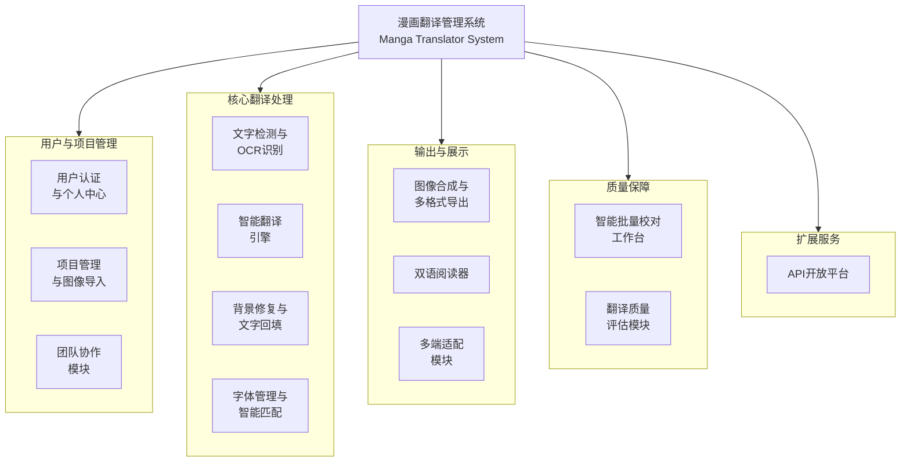

# 漫画智能翻译系统 - 功能结构图

---

## 层次说明

| 层级 | 分类 | 包含模块 | 职责 |
|------|------|----------|------|
| 第一层 | **用户与项目管理** | 用户认证与个人中心、项目管理与图像导入、团队协作 | 用户体系、项目全生命周期、多人协同 |
| 第二层 | **核心翻译处理** | 文字检测与OCR、智能翻译、背景修复与文字回填、字体管理与智能匹配 | AI核心流水线：检-译-修-填-字 |
| 第三层 | **输出与展示** | 图像合成与导出、双语阅读器、多端适配 | 结果交付、学习体验、跨端一致性 |
| 第四层 | **质量保障** | 智能批量校对工作台、翻译质量评估 | 人工/AI混合质检、质量量化度量 |
| 第五层 | **扩展服务** | API开放平台 | 对外能力开放、第三方集成 |

## 模块详细分解

### 第一层：用户与项目管理（3个）
| 模块 | 子功能 |
|------|--------|
| 用户认证与个人中心 | 注册/登录、JWT鉴权、个人信息、偏好设置 |
| 项目管理与图像导入 | 项目CRUD、单张/批量/URL导入、格式转换预览 |
| 团队协作 | 成员邀请、角色权限、项目共享 |

### 第二层：核心翻译处理（4个）
| 模块 | 子功能 |
|------|--------|
| 文字检测与OCR识别 | 漫画专用检测、多语言OCR、选区视觉最小化 |
| 智能翻译引擎 | 上下文感知翻译、术语库、多模型切换 |
| 背景修复与文字回填 | 智能擦除、纹理重建、文字渲染回填 |
| 字体管理与智能匹配 | 字体上传、自动匹配、风格分类 |

### 第三层：输出与展示（3个）
| 模块 | 子功能 |
|------|--------|
| 图像合成与导出 | 图层合成、ZIP/PDF/CBZ导出、分辨率选择 |
| 双语阅读器 | 原译对照、生词本、TTS朗读 |
| 多端适配 | PC端布局、移动端响应式、触控手势优化 |

### 第四层：质量保障（2个）
| 模块 | 子功能 |
|------|--------|
| 智能批量校对工作台 | 批量编辑、一键修正、版本对比 |
| 翻译质量评估 | BLEU/METEOR评分、人工打票、置信度标注 |

### 第五层：扩展服务（1个）
| 模块 | 子功能 |
|------|--------|
| API开放平台 | API Key管理、调用配额、文档中心 |
